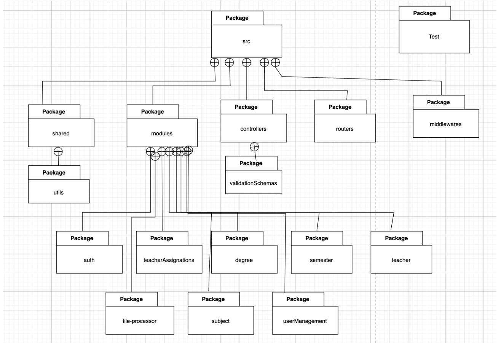
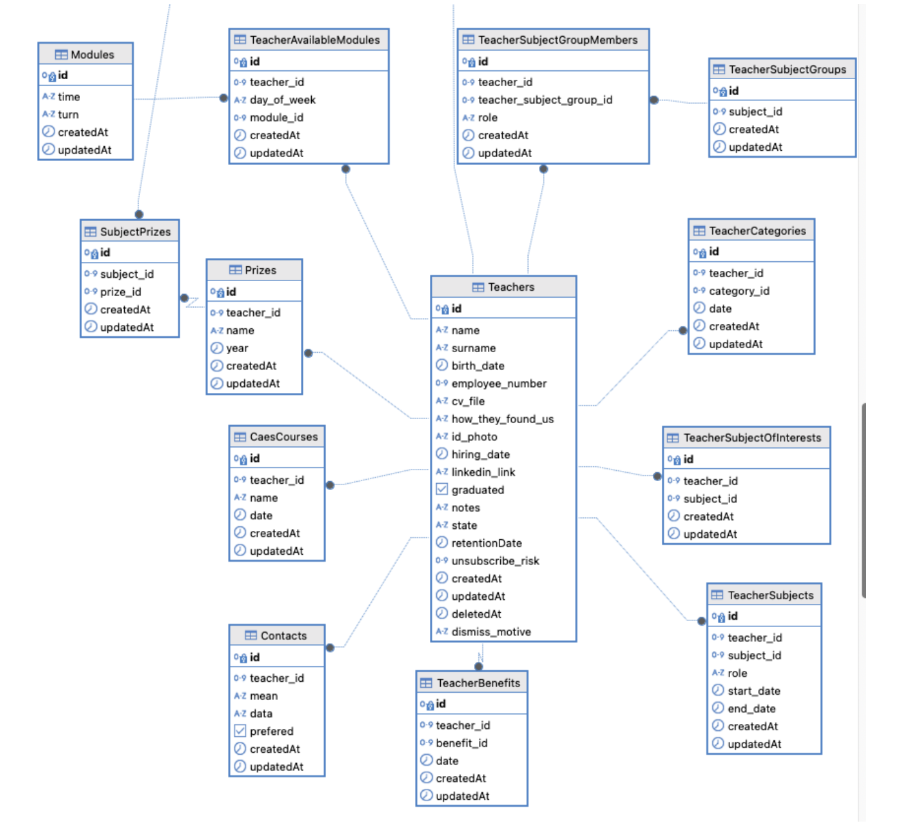
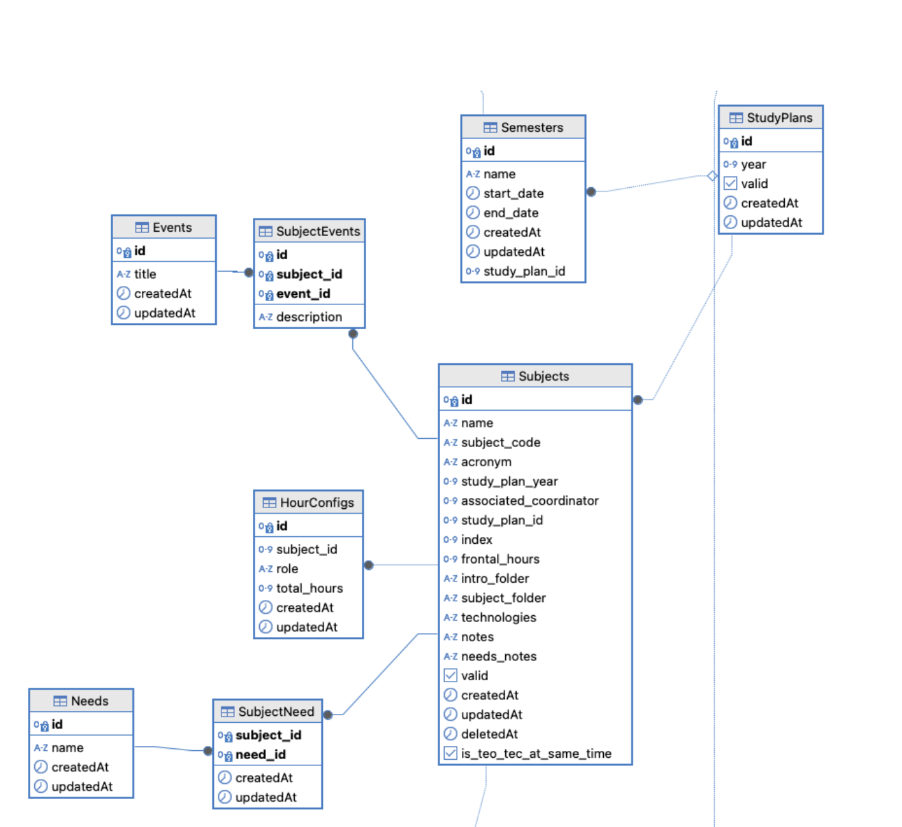
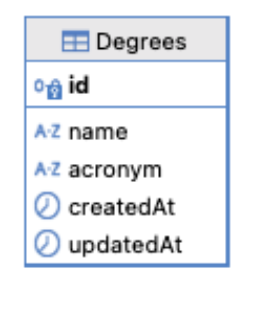
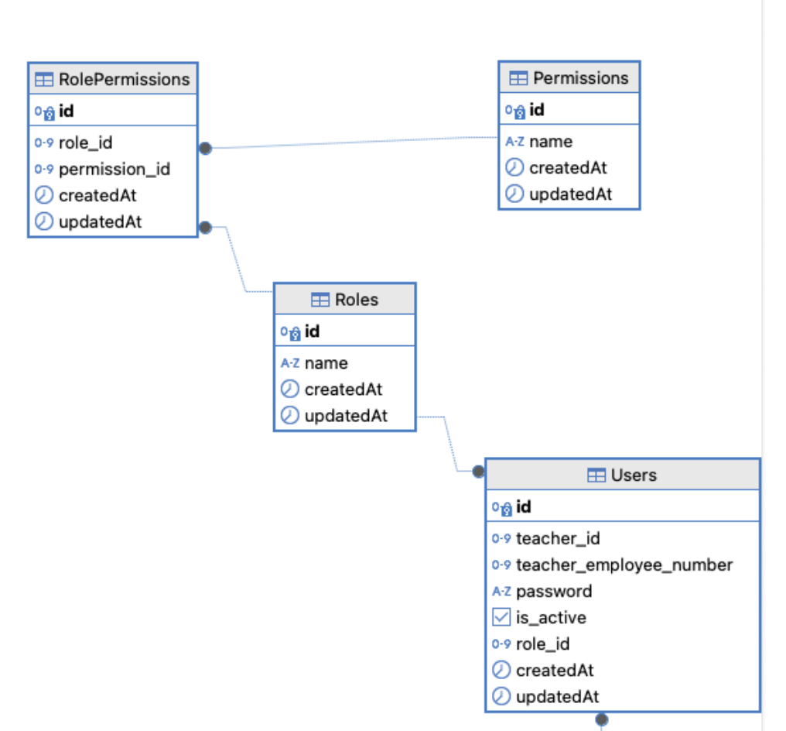

## Estructura y Modelos de datos

La arquitectura utilizada para la realización de este proyecto fue un monolito modular, por lo cual cada módulo se encuentra separado de los otros. Para obtener datos de un determinado módulo, se debe solicitar dicho dato al módulo experto en lugar de acceder directamente a la tabla en la base de datos.

## Vista de módulos

En la imagen de arriba se puede ver la vista de módulos del backend.

- **test:** Contiene todos los unit test del backend.
- routers: Define los endpoints de la API
- **middleware:** Contiene todos los middlewares del backend
- **controllers:** Valida que los datos de la request sean los correctos y autentica
  al usuario
  - **validationSchema:** contiene los esquemas de inputs para validar los
    datos de entrada a los distintos endpoints.
- **utils:** Contiene funciones útiles o constantes que utilizan varios paquetes del
  proyecto.
- **modules:** en este paquete están los distintos módulos de la solución:
  - **auth** se encarga de todo lo relacionada con la autorización y autenticación
  - **teacherAssignation:** Contienen la lógica de detectar los conflictos en las asignaciones docentes y también es quien se comunica con el servicio de python para realizar la asignación automática.
  - **fileProcessor:** Contiene toda la lógica de lectura de planillas Excel
  - **semester:** Contiene un módulo service y otro repository los cuales manejan toda la lógica y funcionalidad de los semestres. Este último
    es quien se comunica con la base de datos.
  - **teacher:** Análogo a semester pero para los profesores
  - **subject:** Análogo a semester pero para las materias
  - **degree:** Análogo a semester pero para las carreras
  - **userManager:** Maneja todo lo relacionado a los usuarios en el
    sistema, los distintos tipos, el logIn y creación de usuarios.

## Modelos de datos

Los modulos que persisten entidades en la base de datos son:

- **teacher**
- **subject**
- **semester**
- **degree**
- **userManagement**

### Teachers

El módulo teacher se encarga de todo lo relacionado a los profesores. Guarda datos personales relevantes como su nombre, fecha de nacimiento, fecha de contratación, medio de comunicación preferido, medio de comunicación, entre otros. Y datos más relevantes para la asignación docente como módulos de horas disponibles en las que puede dar clase, otros profesores con los que hace buen equipo, materias que dio anteriormente, y más.

### Subject

El módulo subject se encarga de todo lo relacionado a las materias. Guarda los datos de las materias y todo lo relacionado a estas, como nombre, acrónimo, plan de estudio al que pertenece, cantidad de horas de teórico y de tecnología, etc. También guarda quién es el coordinador de dicha materia, además de los eventos que esta materia tiene, por ejemplo: primer parcial, segundo parcial, primera entrega, etc. Son datos que son relevantes para las materias. Además, registra necesidades especiales que pueden llegar a tener las materias como computadoras o proyector, etc.

### Semester

El módulo semester se encarga de todo lo relacionado a los semestres. Guarda información relevante como qué día arranca y termina el semestre. Qué dictados hay en este semestre. Los dictados guardan datos como de qué materia son, en qué horario y día se dictan y quiénes son los profesores que los dictan.

### Degree

El módulo degree contiene la información de las carreras. Esto es por si el día de mañana deciden agregar carreras nuevas, decidimos hacerlo como una tabla de la base de datos. Actualmente no posee mucha información más que el nombre y el acrónimo. Se usa al leer el Excel que viene del backoffice con los horarios de las materias; este está separado por carreras, y hay que solo leer el de las carreras de Ingeniería en Sistemas y de Licenciatura en Sistemas.

### UserManagement

El módulo user contiene la información relevante de los usuarios, número de docente, contraseña (la cual se guarda hasheada) y todo lo relativo a las funcionalidades de los usuarios. Permite crear nuevos usuarios, editarlos y manejar los distintos permisos de los distintos tipos de usuarios, coordinadores y docentes. Se decidió guardar los roles en una tabla por si el día de mañana deseaban agregar nuevos tipos de usuarios.

